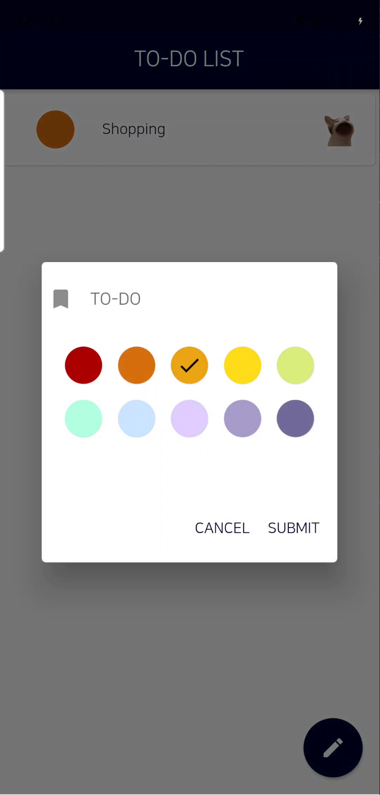

# Pop-cat Checklist
A simple to-do checklist application written in Flutter framework (Dart). This should not make sense, but I just made it for fun anyway.
## Notes
There were few features that were requested by the "commissioner". 

* Must have a sound effect when "popping" the cat.
* Popping the cat does not necessarily mean the item should be removed.
* Removing the item can be done by sliding to the sides.
* Manual rearrangement of items can be done with hold-and-drag.
* Should have color codes for binning items.
* Items can be sorted by pulling down the list, which sorts item according to this order (pinned, done, name).
* List should persist after quitting the app.

  
  &nbsp;&nbsp;&nbsp;&nbsp;&nbsp;
  

